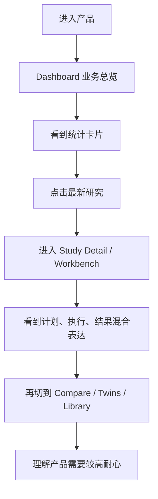
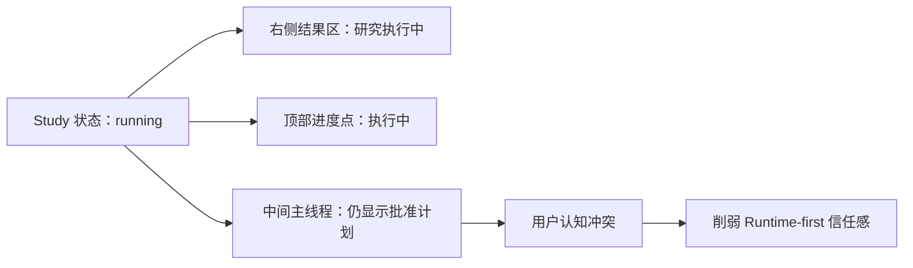
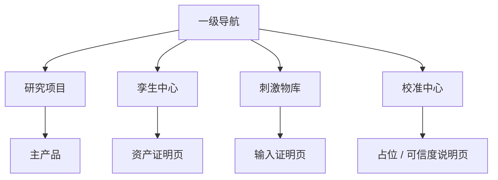
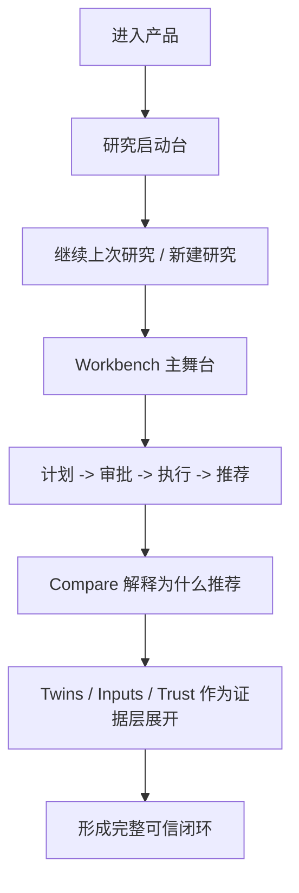

# AIpersona 前端完整摸排报告

审计日期：2026-04-12  
审计对象：`AIpersona-demo` 当前前端演示环境  
审计方法：`product-ux-evaluator` + `ux-researcher-designer` + `mermaid-diagrams` + `onboarding-cro` + 浏览器真实走查  
审计目标：从前端功能布局、交互设计、功能设计三个层面，判断当前版本是否足以支撑对外演示、业务说服力与后续产品竞争力

---

## 一、老板版结论

当前前端不是“方向错了”，而是：

`产品骨架对了，但价值表达顺序、状态表达一致性和移动端可用性还没有达标。`

更直接地说：

1. `Workbench / Compare / Twins / Evidence` 这套骨架是成立的，说明产品方向已经站住。
2. 但当前前端还没有把 Runtime-first Agent 产品最关键的差异讲清楚：
   - 研究是怎么被发起的
   - 审批是怎么插进去的
   - 执行状态怎么变化
   - 结果为什么可信
3. 页面里已经出现了明显的“状态错位”：
   - Study 已经在运行，主对话区还在展示“批准计划”
   - 页面能读到研究结果，但 Agent 消息轮询还在跨域报错
   - `Calibration Center` 还是占位性质，却已经被抬到一级导航
4. 移动端已经不是“体验一般”，而是 `明显影响演示可信度`：
   - 主舞台信息过长
   - 对比页阅读成本高
   - 关键信息层级没有针对手机重排

一句话判断：

`现在这版可以证明“有产品雏形”，但还不足以稳定证明“这是一个可交付、可信、可扩展的 Runtime-first Agent 产品”。`

---

## 二、综合评分

| 维度 | 评分 | 业务判断 |
|---|---:|---|
| 产品方向 | 4.5/5 | 主产品方向正确，故事可成立 |
| 前端功能布局 | 2.5/5 | 主次关系有了，但成熟度混放 |
| 交互设计 | 2.5/5 | 看得见功能，看不清下一步 |
| 功能设计成熟度 | 3/5 | 主路径可演示，辅助页偏证明型 |
| Runtime-first 可感知度 | 2/5 | 运行时能力存在，但前台没讲透 |
| 对外演示说服力 | 2.5/5 | 有亮点，但信任链不够稳 |
| 移动端可用性 | 1.5/5 | 不适合老板或客户临时手机预览 |
| 综合结论 | 2.7/5 | 值得继续投，但必须做一轮前台表达层重构 |

---

## 三、本轮摸排覆盖范围

本轮不是只看代码，而是做了四层交叉验证：

1. 文档层  
   核对了 `README.md`、`docs/handoff.md`、`docs/planning/mvp_prd.md`、`docs/planning/frontend_design.md`

2. 页面结构层  
   盘点了：
   - `Dashboard`
   - `Studies`
   - `Workbench`
   - `Compare`
   - `Consumer Twins`
   - `Stimulus Library`
   - `Calibration Center`

3. 真实走查层  
   使用浏览器真实访问：
   - 桌面端
   - 移动端
   - `Draft / Running / Completed` 三种研究状态

4. 运行链路层  
   验证了前端、API、数据库隧道和运行时报错，确认哪些问题属于产品体验，哪些问题属于演示环境风险

---

## 四、最关键的5个发现

### 发现 1：主舞台是对的，但入口不是最优

当前产品真正的核心价值在 `Workbench`，但用户第一眼先进的是 `Dashboard`。  
而当前 Dashboard 更像一个运营看板，而不是“让我快速进入价值”的入口。

业务后果：

- 老板第一眼看不到“这产品能帮我做什么决定”
- 客户第一分钟感受到的是“系统信息”，不是“研究价值”
- 主产品价值被总览页稀释

建议：

- `Dashboard` 从“统计看板”改成“决策启动台”
- 把“继续上次研究 / 新建研究 / 查看推荐结果”提升为首屏主动作

### 发现 2：运行状态表达不一致，直接伤害信任

在真实走查里，`Running` Study 的右侧结果区已经显示“研究执行中”，但中间主线程仍然保留“批准计划”卡片。

这不是小问题，而是会直接让用户怀疑：

`到底是已经开始跑了，还是还没审批？`

对于 Runtime-first Agent 产品，这类错位是高风险，因为你卖的不是聊天，而是“可恢复、可审批、可追踪的研究运行时”。

建议：

- 每个状态只允许一个主动作
- 中区和右区必须共用同一套状态机
- 不允许出现“左边还在上一步，右边已经到下一步”的表达

### 发现 3：一级导航把不同成熟度页面放平了

当前一级导航包括：

- 业务总览
- 研究项目
- 孪生中心
- 刺激物库
- 校准中心

问题不是页面多，而是成熟度不同：

- `研究项目 / Workbench` 已经是主产品
- `孪生中心 / 刺激物库` 是资产证明页
- `校准中心` 目前仍偏占位页

业务后果：

- 用户误以为这些页面成熟度相同
- 主舞台没有被充分突出
- 演示注意力被非核心页面分散

建议：

- 一级导航收敛到 `研究项目 / 孪生中心 / 刺激物库`
- `校准中心` 先降为证据层入口，而不是一级主页面

### 发现 4：Compare 页有冲击力，但过早独立

`Compare` 页本身是有价值的，它把“为什么推进清泉+”讲得很清楚。  
但它现在已经像一个独立主页面，而不是从 Workbench 结果自然延展出来的“决策解释页”。

业务后果：

- 用户会在 Workbench 和 Compare 之间来回切换
- 结果解释和研究过程被拆开
- 主舞台的完整叙事被打断

建议：

- 保留 Compare，但明确它的角色是 `决策解释视图`
- Workbench 完成态里只露出最必要结论，然后从结果区自然进入 Compare

### 发现 5：移动端当前不适合对外分享

真实手机视图里，核心问题非常明显：

- 文案和卡片过长
- 首屏信息层级不够清楚
- 对比页阅读压力大
- 研究详情与结果层在手机上没有重新组织

业务后果：

- 老板微信里临时点开链接，会认为产品还停留在桌面原型阶段
- 客户在会议间隙手机预览，印象会显著打折

建议：

- 移动端不要追求“完整搬运桌面布局”
- 应改为：
  - `首屏结论`
  - `一键展开证据`
  - `再下钻查看过程`

---

## 五、当前用户旅程问题图

### 1. 当前首触达路径

判断：

当前路径不是“先看价值，再看证据”，而是“先看信息，再自己拼价值”。

### 2. 当前 Workbench 状态错位

### 3. 当前信息架构问题

问题：

用户无法一眼判断谁是主舞台，谁是证明层。

### 4. 推荐的理想路径

### 5. 推荐的演示节奏

---

## 六、按维度的完整摸排

## 6.1 前端功能布局

### 优点

- 左侧导航、主内容区、结果区的工作台结构已经成立
- `Workbench` 和 `Compare` 的角色分工基本清楚
- `Twins` 和 `Stimulus Library` 至少已经具备“资产页”雏形

### 问题

1. 首页没有把主价值推到前面
2. 一级导航塞入了成熟度不一致的页面
3. `Calibration Center` 当前还不足以承担一级入口
4. 研究详情顶部、主线程、右侧结果区之间存在重复和抢戏

### 业务影响

- 演示时间被分散
- 用户不容易聚焦主产品
- 可信度建设被拆散

---

## 6.2 交互设计

### 优点

- 状态标签、进度点、右侧结果区已经具备“研究正在发生”的感知
- 完成态的 CTA 比较清楚：
  - 进入消费者验证
  - 查看详细对比
  - 下载报告

### 问题

1. 同一时刻出现多个主动作
2. 中区与右区状态表达不一致
3. Study 详情里的顶部标签、结果区标签、证据入口标签较多，认知切换频繁
4. 移动端结果查看依赖抽屉式打开，虽然能用，但阅读节奏不够顺

### 业务影响

- 用户知道“能做什么”，但不知道“现在该先做什么”
- Runtime-first 的审批链和执行链没有被清晰传达

---

## 6.3 功能设计

### 当前已经成立的功能

- 研究列表
- Draft / Running / Completed 三类研究状态
- Workbench 主舞台
- Compare 对比解释
- Twins 资产页
- Stimulus Library 资产页
- 基础结果、证据、回放入口

### 当前还没有完全成立的功能表达

1. `Agent 协作感`
   原因：Agent 消息轮询存在跨域报错，导致“Agent 正在参与”这一层体验不稳

2. `审批感`
   原因：审批动作与执行动作在页面上的切换不够干净

3. `校准闭环`
   原因：Calibration Center 还没有达到能独立撑起一级页面的完成度

4. `移动端首屏决策感`
   原因：手机里先看到的是长内容和层层卡片，不是“我现在该做什么”

---

## 七、最重要的业务风险

### P0：现在就会影响对外演示

1. 运行状态错位  
   已在真实 Running Study 中出现

2. Agent 消息跨域报错  
   页面数据可见，但 Agent 轮询访问了 `100.75.231.2:8000`，会让协作体验不稳定

3. 移动端信息过载  
   手机端不适合直接给老板或客户看

### P1：会拖慢产品说服力

1. Dashboard 不是价值启动台
2. Studies 列表重复度高，缺少筛选和优先级
3. Compare 过早独立，割裂主舞台

### P2：会影响高级感和完成度

1. 中英风格与术语仍不够统一
2. 一些成本、状态、结构信息还不够业务化
3. 资产页更像证明页，还不像成熟产品页

---

## 八、优化优先级

## P0：必须优先处理

1. 统一 Workbench 状态机表达  
   目标：同一时刻只有一个主状态、一个主动作

2. 把 `Calibration Center` 从一级导航降级  
   目标：把注意力还给主舞台

3. 重做 Dashboard 首屏  
   目标：让它承担“进入价值”的责任，而不是只做总览

4. 修复 Agent 轮询链路  
   目标：让“Agent 正在协作”这件事前台成立

5. 做移动端重排  
   目标：手机上先看结论，再看证据，再看过程

## P1：短期优化

1. Studies 列表增加状态分组和优先级
2. Workbench 完成态减少重复说明
3. Compare 页和 Workbench 结果区重新分工
4. Twins / Library 改成更强的资产叙事

## P2：中期优化

1. 增加更强的空状态设计
2. 增加更清晰的“下一步行动”设计
3. 提升资产页与可信度页的产品完成度

---

## 九、建议的改造顺序

### 阶段 1：先修主叙事

- Workbench 状态统一
- Dashboard 改造成启动台
- `Calibration` 降级

### 阶段 2：再修说服力

- Compare 与 Workbench 职责重划
- Studies 列表按状态重构
- 资产页提升业务解释力

### 阶段 3：最后修观感与移动端

- 手机端重排
- 术语统一
- CTA 收敛

---

## 十、预期业务收益

如果按上面的顺序改，这个前端最直接的收益不是“更美观”，而是：

1. `30 秒内看懂产品价值`
2. `2 分钟内建立研究流程信任`
3. `5 分钟内确认它不是普通 Chat UI，而是可交付的 Runtime-first Agent 产品`

这三点，才是比稿和后续交付里最值钱的部分。

---

## 十一、结论

当前这版前端已经证明：

`产品方向成立。`

但还没有完全证明：

`这是一套可信、稳定、可交付的 Runtime-first Agent 工作台。`

下一轮前端工作不应该只是“继续补页面”，而应该围绕三件事收敛：

1. 主舞台优先
2. 状态机一致
3. 证据层后置但更可信

只有这样，这个产品才能从“有雏形”进入“有竞争力”。

