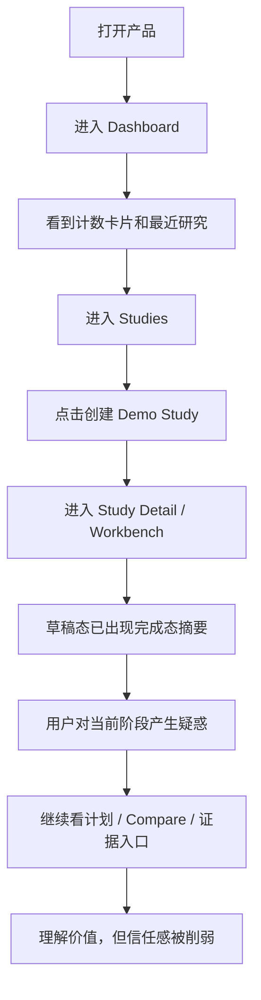
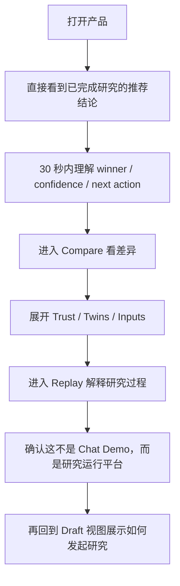
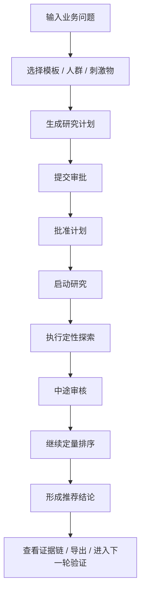
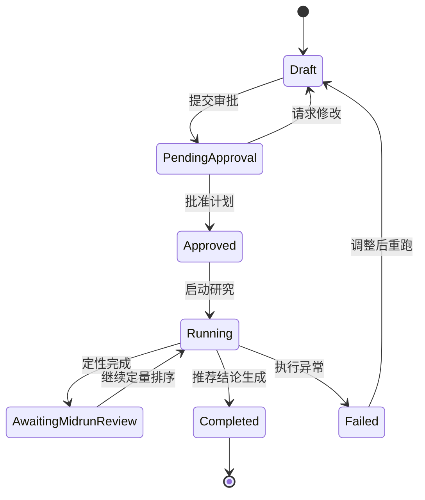
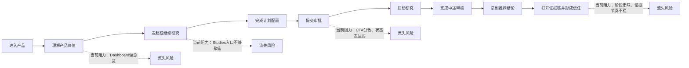
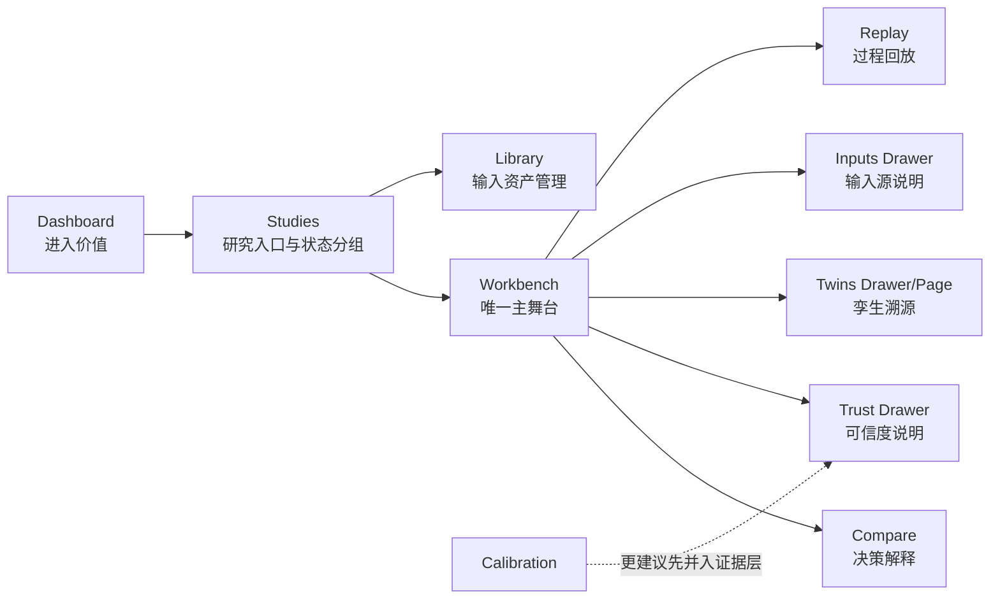

# AIpersona Demo 产品体验系统摸排报告

审计日期：2026-04-12  
审计对象：`AIpersona-demo` 当前前端演示环境  
审计方法：`product-ux-evaluator` + `ux-researcher-designer` + `mermaid-diagrams` + `onboarding-cro` + `playwright` 真实走查  
审计目标：从前端功能布局、交互设计、功能设计三个层面，判断当前产品是否真正支撑“达能 AI Consumer Workbench”的业务价值、演示说服力和产品竞争力

---

## 一、老板版结论

这套前端的最大问题，不是“还不够好看”，而是：

`产品主叙事已经对了，但前台表达还没有把 Runtime-first 的可信研究流程讲清楚，反而经常提前泄露结果、重复展示信息、压缩主舞台，导致用户很难自然进入价值，也很难建立信任。`

更直接一点说：

1. `Workbench` 的产品方向是对的，`Compare / Twins / Evidence` 也有正确的辅助定位。
2. 但当前前端把“草稿态、执行态、完成态”混在一起表达，已经伤到了最关键的业务信号：`为什么这套系统值得信、为什么它不是一个包装过的 AI Chat Demo。`
3. 如果拿当前版本去做高强度对外演示，最危险的不是功能缺失，而是 `信任感错位`:
   - 还没跑完研究，页面已经在“建议推进 清泉+”
   - 还没完成执行，Compare 页面已经像结论页
   - Runtime 的审批、恢复、回放、证据链，本来是你的核心竞争力，但在 UI 上并没有形成稳定、一致、可理解的主线
4. 移动端当前基本不可用。对于老板、客户、评审临时拿手机看链接的场景，这是明显减分项。

一句话判断：

`现在的前端已经具备“有产品雏形”的说服力，但还没有达到“可稳定打动甲方”的产品完成度。`

---

## 二、总评分

| 维度 | 评分 | 判断 |
|------|------|------|
| 产品叙事清晰度 | 4/5 | 核心故事是对的，方向感强 |
| 信息架构 | 2.5/5 | 主次关系基本有，但层级还不干净 |
| 关键交互设计 | 2/5 | 用户知道能做什么，但不清楚下一步怎么做 |
| 功能成熟度 | 2.5/5 | 主路径有形，辅助页偏“证明页/占位页” |
| Runtime-first 可感知度 | 2/5 | 状态机存在，但前台表达失真 |
| 比稿转化力 | 2.5/5 | 结论展示有冲击力，但信任链不够稳 |
| 移动端可用性 | 1/5 | 当前不适合真实使用或演示转发 |
| 综合判断 | 2.4/5 | 值得继续推进，但必须做一轮产品表达层重构 |

---

## 三、审计依据

本轮不是只看文档，而是做了三层交叉验证：

1. 文档层
   - `docs/handoff.md`
   - `docs/planning/mvp_prd.md`
   - `docs/planning/frontend_design.md`
   - `docs/user-journey-audit.md`
   - `docs/ux-review-20260412.md`
2. 代码层
   - 路由、壳层、Study Detail 包装层、Workbench 主舞台、Result Panel、Compare / Twins / Library / Calibration 页面
3. 真实走查层
   - 本地运行实例：`http://127.0.0.1:5173`
   - 通过 Playwright 走查桌面端与移动端
   - 截图核对 Dashboard、Studies、Workbench、Compare、Twins、Library、Calibration

---

## 四、核心角色与关键任务

### 1. 市场用户

最关心：

- 哪个概念更值得推进
- 为什么推进它
- 下一步动作是什么

这类用户不关心系统实现，只关心：

`能不能更快、更稳、更清楚地做出决策`

### 2. 洞察用户

最关心：

- 研究计划是否合理
- twin 选择是否可信
- qual + quant 是否真的跑过
- 结论为什么成立

这类用户要看到：

`审批、执行、回放、证据链、可信度解释`

### 3. 比稿决策者 / 老板

最关心：

- 第一眼能不能看见业务价值
- 第二眼能不能建立信任
- 第三眼能不能判断这不是 PPT 工程，而是可交付产品

这类角色需要的不是功能列表，而是：

`30 秒看到价值，2 分钟建立信任，5 分钟确认可落地`

---

## 五、目前最值得肯定的地方

### 1. 产品定位已经基本站稳

这不是普通 BI，也不是纯聊天助手。  
`Workbench + Compare + Twins + Evidence` 的产品骨架是正确的。

### 2. 业务故事是成立的

“业务问题 -> 计划 -> qual/quant -> recommendation -> evidence” 这条主线，本身就是对的。  
你要卖给达能的，不是 UI，而是 `一个可以更快做消费者学习与刺激物筛选的研究工作台`。这一点在文档和部分页面中已经体现出来。

### 3. 完成态页面已经有一定说服力

当 study 处于已完成状态时：

- 推荐结论
- 置信度
- 排名差异
- 定性主题
- 证据链入口

这几块组合起来，已经有“像产品”的基础，而不是单纯原型。

### 4. Evidence Layer 的思路是对的

把 `Trust / Twins / Inputs / Replay` 做成证据层，而不是和主舞台平铺竞争，这是对企业级 AI 产品很重要的设计判断。

---

## 六、系统性问题总览

### P0 级问题：已经伤害业务可信度

1. `草稿态泄露完成态结论`
2. `Study Detail 包装层过重，压缩了真正的 Workbench 主舞台`
3. `主路径的下一步动作不够显性，审批/启动/执行被拆散表达`
4. `移动端布局严重变形`

### P1 级问题：已经影响转化效率

1. Dashboard 更像数据总览，不像“进入价值”的起点
2. Studies 列表混合了中英文、不同成熟度数据、不同状态，叙事杂乱
3. Compare / Twins / Library / Calibration 的成熟度不一致，但都被放在一级导航中
4. 当前页面存在较多重复信息，信息密度不高但占空间很大

### P2 级问题：已经影响产品高级感

1. 中英混排不统一
2. UUID、Token、预算值等技术/内部表达直接暴露
3. 部分辅助页更像“功能证明”而不是“产品能力”

---

## 七、详细诊断

## 7.1 前端功能布局

### 问题 1：主舞台被包装层抢戏

当前 `Study Detail Layout` 在真正进入 `Workbench` 之前，已经先展示了一整块“推荐摘要 + 证据卡 + 视图切换”。

这会带来三个业务后果：

1. 用户还没进入研究过程，就已经被告知结论
2. Workbench 对话区被压到下半屏，Agent-first 感知明显变弱
3. Result Panel 的价值被提前透支，导致页面出现信息重复

这不是单纯的布局问题，而是：

`主叙事顺序被打乱了`

你要卖的是一个运行中的研究工作台，而不是一个先给答案、再让人补看过程的壳层容器。

### 问题 2：一级导航承载了成熟度不同的页面

当前一级导航包括：

- 业务总览
- 研究项目
- 孪生中心
- 刺激物库
- 校准中心

问题不在于页面多，而在于它们处于不同成熟度：

- `研究项目 / Workbench` 已经接近主产品
- `孪生中心 / 刺激物库` 更像能力证明页
- `校准中心` 目前还是占位页

这会造成一个产品认知问题：

`用户会误以为这些页面成熟度相当`

但实际上并不是。结果就是：

- 主舞台的价值没有被突出
- 占位页稀释了整体完成度

### 问题 3：Dashboard 没有承担“首个价值入口”的责任

当前 Dashboard 主要展示计数卡片和最近研究。

这对内部系统可能成立，但对当前产品阶段不够：

- 不能快速解释“我来这里第一件事该做什么”
- 不能快速解释“这个系统现在能帮我做出什么判断”
- 不能快速进入价值

它更像 `运营概览页`，而不是 `高管/业务用户的第一入口`

---

## 7.2 交互设计

### 问题 4：主路径里的“下一步动作”不够稳定、不够显性

当前主流程中，很多关键动作并不是以统一的强 CTA 出现，而是分散在：

- suggestion chips
- 卡片动作
- 结果面板按钮
- 顶部 tab

这会让用户产生两个感受：

1. 我知道这个系统能做很多事
2. 但我不确定此刻我最该点哪个

对于研究型工作台，最重要的不是动作多，而是：

`每个状态只给一个最正确的下一步`

比如：

- Draft：`提交审批`
- Pending Approval：`批准计划`
- Approved：`启动研究`
- Awaiting Mid-run Review：`继续定量排序`
- Completed：`查看对比 / 导出报告 / 进入下一步验证`

现在这条链条在页面上并没有被清晰统一地表达出来。

### 问题 5：草稿态与完成态发生“阶段串味”

真实走查中可以确认：

- 草稿 study 的 Workbench 顶部已经出现“建议推进 清泉+”
- 草稿态 Compare 页面也可以正常打开，并呈现类似完成态的解释结构

这会直接破坏信任。

因为用户会立刻问：

`你到底是已经跑过了，还是还没跑？`

一旦这个问题出现，整套 Runtime-first 叙事就被削弱了。

这不是一个小 bug，而是：

`前端把状态机表达错了`

### 问题 6：Agent-first 体验还没有真正成立

理论上，Workbench 的中区应该是 Agent-first 的核心来源。  
但实际体验里：

- 对话内容偏弱
- 研究过程的推进感不够强
- 用户对“AI 正在如何工作”感知较弱

结果就是：

`看起来像有对话区，但还不像一个真正带着你完成研究的 Agent`

### 问题 7：移动端基本不可用

真实截图显示：

- 左侧 Rail 占据主要屏宽
- 内容区被压成窄条
- 中文文本竖向挤压
- 首屏没有形成有效可读布局

这意味着：

- 手机打开链接时，无法形成正向第一印象
- 老板或客户临时点开会直接感觉“不成熟”

这对演示型产品是实质性风险。

---

## 7.3 功能设计

### 问题 8：Studies 页是“研究列表”，不是“研究入口”

当前 Studies 页有两个问题：

1. 创建动作太轻
2. 列表内容太杂

它现在更像数据库列表，而不是“研究工作入口”。

理想状态下，Studies 页应该回答：

- 我现在最该继续哪个研究
- 我想发起一个新研究，该走哪条模板
- 哪些研究卡在审批，哪些研究已出结论

而不是简单把不同状态的研究平铺出来。

### 问题 9：孪生中心与刺激物库目前更像“看板”，不像“工作页”

当前：

- `Twins` 基本只读
- `Library` 只有一个演示式导入动作

这没有错，但需要重新定义它们在 demo 中的角色。

如果它们暂时不是“可操作工作页”，就应该明确定位成：

`资产证明页`

而不是让用户以为自己会在这里完成日常工作。

### 问题 10：校准中心放在一级导航里，但当前还不构成产品价值

校准中心目前是一个“未来能力预告页”。

这类页面在内部没问题，但在对外 demo 中放到一级导航，会带来两个副作用：

1. 稀释成熟功能的权重
2. 暴露“这里还没做好”

如果你要强调 Runtime-first 与可信度能力，更好的做法是：

- 在 Workbench 的 Evidence Layer 中露出校准能力
- 一级导航先不让它独立承担“成熟模块”的角色

---

## 7.4 Runtime-first Agent 表达是否成立

按照 Runtime-first 的要求，前台至少要让用户感知 7 件事：

1. 现在在哪个状态
2. 为什么停在这里
3. 下一步谁来决策
4. 可以执行什么动作
5. 已经沉淀了什么证据
6. 中断后能否恢复
7. 为什么这条推荐可信

目前系统在“后端模型与文档设计”上已经考虑了很多，但前台表达仍然存在明显缺口：

### 缺口 1：状态存在，但状态解释不稳定

用户能看到一些状态标签，但不一定知道：

- 这个状态意味着什么
- 为什么需要这个状态
- 我此刻应该做什么

### 缺口 2：审批链是卖点，但没有成为前台主叙事

审批、mid-run review、resume，本来是企业级研究系统非常强的差异化能力。  
但现在它们在 UI 里更像若隐若现的节点，而不是“这套系统更可信”的直接证明。

### 缺口 3：证据链有入口，但没有形成“先主线、后举证”的稳定节奏

现在有时会先看见结论，有时先看见证据卡，有时又要先进入 Workbench。  
缺少一个稳定的、可预测的阅读顺序。

结论：

`Runtime-first 的后端设计思路是对的，但前端还没有把它翻译成一个足够可信、足够顺手、足够高级的产品表达。`

---

## 八、用户旅程与转化诊断

## 8.1 当前实际旅程

### 当前旅程的核心问题

不是没有路径，而是路径“会走歪”：

- 用户进入得去
- 页面也有内容
- 但心理上并不顺

体验结果是：

`用户理解了这个系统想干什么，但没有被顺滑地带到“我愿意相信它、我愿意继续用它”这一步。`

---

## 8.2 建议的 Demo 旅程

### 为什么这个旅程更强

因为它符合老板和甲方的注意力顺序：

1. 先看结果值不值
2. 再看为什么能信
3. 最后看如何发起

这也更符合你当前比稿阶段的商业目标。

---

## 8.3 建议的真实使用旅程

这条旅程的核心原则只有一句：

`一个状态，一个主动作。`

---

## 8.4 Runtime 状态机应该如何被前台表达

当前问题不是没有这些状态，而是：

`这些状态没有被前台做成稳定、统一、可预期的产品动作。`

---

## 8.5 当前转化漏斗判断

下面这张图不是实测数据，而是基于当前界面结构与真实走查做出的定性判断。

---

## 九、关键问题矩阵

| 问题 | 业务后果 | 证据 | 优先级 |
|------|----------|------|--------|
| 草稿态提前展示推荐结论 | 直接伤害可信度，像“伪运行” | 真实走查已出现 | P0 |
| Study Detail 包装层过重 | 主舞台被压缩，Agent-first 变弱 | 真实截图明显 | P0 |
| 关键 CTA 分散 | 用户知道能做很多事，但不知道先做什么 | 真实走查 + 代码结构 | P0 |
| 移动端严重变形 | 手机打开即减分，影响外部传播与高管预览 | 真实截图明显 | P0 |
| Dashboard 不能快速进入价值 | 首访转化差，第一印象偏后台 | 真实走查明显 | P1 |
| Studies 列表缺少状态分组和模板入口 | 研究入口不够强，像记录列表 | 真实走查明显 | P1 |
| Compare/Twins/Library/Calibration 成熟度不一致 | 稀释主舞台价值，降低产品完成度 | 页面现状明显 | P1 |
| 中英混排、UUID、技术值暴露 | 高级感不足，像内部工具 | 代码 + 截图 | P1 |
| 孪生中心/刺激物库偏只读 | 有证明感，缺工作感 | 真实走查明显 | P2 |
| 校准中心一级入口过早 | 暴露未完成模块 | 真实走查明显 | P2 |

---

## 十、Onboarding / 激活优化建议

## 10.1 建议先定义两个激活目标

### 激活目标 A：比稿激活

适用于老板、甲方、评审。

定义：

`用户在 30 秒内看懂“推荐什么、为什么、下一步是什么”。`

### 激活目标 B：真实使用激活

适用于市场/洞察用户。

定义：

`用户在 2 分钟内完成一次研究创建，并明确进入审批或执行状态。`

如果这两个激活目标不分开，当前产品就会一直把：

- demo 叙事
- 真正操作

混在同一条路径里，进而持续产生现在的阶段串味问题。

---

## 10.2 推荐的激活策略

### 策略 1：分离“演示模式”和“工作模式”

建议明确分成两条入口：

1. `演示模式`
   - 默认打开已完成案例
   - 先看 recommendation
   - 再回放 evidence
2. `工作模式`
   - 从问题输入开始
   - 按状态机推进

### 策略 2：把 Dashboard 改成“一个主动作 + 一个最近价值”

当前 Dashboard 的计数卡不够强。  
建议改为：

- 一个主 CTA：`发起新研究`
- 一个最近价值卡：`上次研究得出什么结论`
- 一个可信度入口：`为什么这个结论可信`

### 策略 3：草稿态只讲“计划”，完成态只讲“结论”

这是当前最该立刻修的体验原则：

- Draft 不能提前出现 winner
- Completed 不能还像在做计划

### 策略 4：每个状态只保留一个主按钮

例如：

- Draft：`提交审批`
- Pending：`批准计划`
- Approved：`启动研究`
- Mid-run：`继续定量排序`
- Completed：`查看对比`

其他动作统一降级成次按钮或二级入口。

---

## 10.3 建议追踪的关键指标

以下指标是产品设计目标，不是当前已测得数据：

| 指标 | 当前判断 | 建议目标 |
|------|----------|----------|
| 首屏理解价值时间 | 偏长 | `< 30 秒` |
| 发起研究到提交审批 | 偏长且不稳定 | `< 90 秒` |
| 审批后启动研究点击路径 | 不够显性 | `1 次主点击` |
| 完成态证据链打开率 | 预计偏低 | `> 60%` |
| Compare 访问率 | 有，但节奏不对 | `完成态 > 70%` |
| 移动端首屏可读性 | 极差 | `390px 下可完整阅读核心内容` |

---

## 十一、A/B 测试建议

## Test 1：Dashboard 首屏结构

- A：当前“总览卡片”
- B：`发起新研究 + 最近结论 + 可信度入口`
- 假设：B 会显著提升首访进入主路径的比例

## Test 2：Studies 页创建方式

- A：列表页直接“创建 Demo Study”
- B：模板化入口：`概念筛选 / 命名测试 / 沟通素材测试`
- 假设：B 会提升创建后的理解度与完成率

## Test 3：草稿态 CTA 设计

- A：建议 chip + 分散按钮
- B：页面固定主按钮 `提交审批`
- 假设：B 会提升状态推进完成率

## Test 4：Compare 入口时机

- A：任意状态可进入
- B：仅完成态强化入口，草稿态弱化或隐藏
- 假设：B 会降低用户对阶段的误解

## Test 5：演示模式入口

- A：默认从 Dashboard 开始
- B：默认从已完成案例开始
- 假设：B 会显著提升外部演示转化力

---

## 十二、优化路线图

## Phase 0：下次对外演示前必须完成

### P0-1：彻底修正阶段表达

- 草稿态不再出现完成态 recommendation
- Compare / 证据链入口按状态分级露出
- 完成态与草稿态的页面文案、摘要、CTA 明确区分

### P0-2：把 Workbench 重新拉回主舞台

- 精简或移除 `Study Detail Layout` 的大摘要层
- 保证进入 Workbench 后，第一眼就是研究主舞台，而不是包装层

### P0-3：统一主 CTA 逻辑

- 每个状态一个主按钮
- 其他动作降级
- 把审批、启动、继续执行变成稳定动作链

### P0-4：修正移动端外壳

- Rail 改成抽屉或折叠式
- 首屏只保留核心内容
- 确保 390px 下能正常看懂 Dashboard 和 Workbench

---

## Phase 1：短期产品升级

### P1-1：重做 Dashboard

从“统计总览”改成“进入价值的主页”

### P1-2：重做 Studies

- 增加状态分组
- 增加模板入口
- 增加“继续最近研究 / 待审批 / 已完成结论”三类快捷入口

### P1-3：重新定义辅助页角色

- Twins：资产证明页
- Library：输入资产页
- Calibration：暂时并入证据层，减少一级导航干扰

### P1-4：去技术化表达

- 去 UUID
- 去含义不清的预算数值
- 去内部术语直接暴露
- 统一中文为主的产品表达

---

## Phase 2：产品竞争力强化

### P2-1：把 Workbench 做成真正的“研究驾驶舱”

- 状态解释
- 审批责任提示
- 中断恢复提示
- 执行轨迹可视化

### P2-2：让孪生与证据更“可理解”

- 不只是能点开，而是让用户快速理解：
  - twin 为什么能代表人群
  - calibration 为什么能增加可信度
  - replay 为什么是企业级能力

### P2-3：建立 demo 脚本化入口

- 一键进入完成态案例
- 一键回放关键阶段
- 一键切回发起研究

---

## 十三、如果只做 5 件事，我建议做什么

1. `先彻底修正草稿态/完成态串味问题`
2. `把 Study Detail 包装层砍薄，让 Workbench 成为唯一主舞台`
3. `给每个状态只保留一个主动作`
4. `把 Dashboard 改成“进入价值”的首页，而不是计数页`
5. `修掉移动端壳层，不要让手机打开直接翻车`

---

## 十四、对老板最重要的判断

如果从业务价值角度判断，这个项目前端现在已经过了“方向正确”的阶段，但还没过“表达可信”的门槛。

真正影响成交的，不是你有没有更多功能，而是以下三件事能不能被稳稳讲清楚：

1. `它能更快给出研究结论`
2. `它不是黑箱，它能解释为什么`
3. `它不是一次性 Demo，它背后是 Runtime-first 的研究运行系统`

当前版本第 1 点已经开始成立。  
第 2 点和第 3 点，后端意图有了，但前端表达还没完全立住。

所以这轮前端工作最该做的，不是继续堆页面，而是：

`把主舞台、状态机、证据链和演示入口重新梳顺。`

一旦这一步做好，这个产品的比稿转化力和“像真产品”的感觉都会明显上一个台阶。

---

## 附录：页面关系建议图

