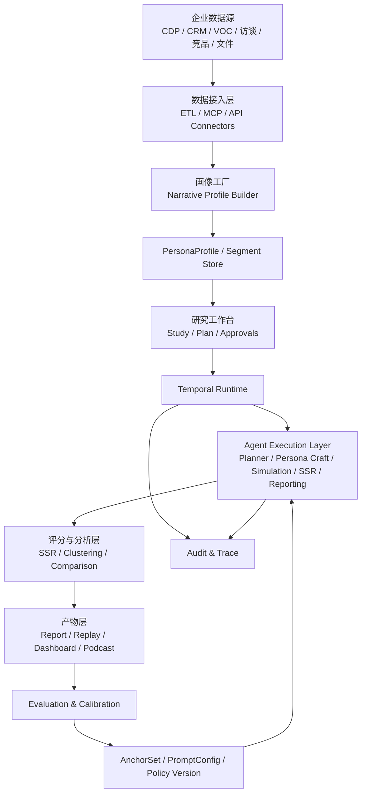

# AI 消费者模拟平台项目蓝图

文档版本：v1  
日期：2026-04-02  
状态：内部蓝图草案  
适用范围：项目立项、产品定义、架构定稿、后续任务拆解

## 1. 项目一句话定义

打造一个面向消费品牌企业的 `Runtime-first AI 消费者研究与决策平台`：把企业的一方数据、自然语言用户画像、消费者模拟、场景对话、语义评分与评测校准闭环整合为一个可持续运行的研究系统，而不是一个只会出报告的聊天工具。

## 2. 为什么现在做

### 2.1 市场侧机会

- 传统消费者研究慢、贵、样本稀缺、反馈失真，尤其在高语境、强社交、强文化属性的品类中更明显。
- CDP 已经积累了大量一方数据，但多数企业仍停留在“标签管理”阶段，没有把这些数据升级为可推演、可交互、可解释的消费者模型。
- LLM 已经能承担两类关键任务：
  - 把结构化事实压缩成叙事型用户画像
  - 在合适的提示、角色设定和评分方法下，对概念测试与购买意向做可用级模拟

### 2.2 技术侧机会

- `SSR` 方法证明了：相比直接让模型输出数值评分，先让模型生成文本反馈，再映射到 Likert 分布，更接近真实人类响应。
- 深访 transcript + LLM 的研究路径证明了：当 persona 不再只是标签，而是更厚的人格与经历文本时，模拟的可信度会明显提升。
- Agent Runtime、MCP、Tracing、Human-in-the-loop 已经成熟到可以支持企业级长流程，而不是只能做单轮问答。

### 2.3 对我们最重要的机会

我们不是去做“又一个问卷工具”，而是去重写企业理解消费者的工作流：

- 从 `调研项目` 升级为 `持续研究运行时`
- 从 `标签人群` 升级为 `可推演消费者对象`
- 从 `静态报告` 升级为 `可回放、可复用、可校准的研究资产`

## 3. 北极星与业务目标

### 3.1 北极星

让企业在 `小时级` 时间内得到足够可信、可解释、可复用的消费者洞察，用于提前筛掉坏决策、放大好决策。

### 3.2 核心业务目标

- 缩短概念测试、包装测试、定价测试、传播创意测试的前置验证周期
- 降低企业对高频小样本人工调研的依赖
- 把 CDP 里的用户事实转化为营销、产品、战略都能读懂的研究资产
- 在企业内部形成“AI 先预判，人类再验证”的新型研究流程

### 3.3 12 个月内要验证的商业假设

- 企业愿意为“更快的研究预判”付费，不要求第一天就完全替代人工研究
- 企业会优先接受“先作为研究前置筛选器”的定位，而不是“完全替代市场部和调研公司”
- 在白酒、食品饮料、美妆个护、保健品等高感知品类中，场景模拟和 narrative profile 的价值显著高于通用品类
- 如果能建立“校准报告 + 回放链路 + 审批节点”，企业对 AI 消费者模拟的信任会明显提升

## 4. 产品定位

### 4.1 我们不是什么

- 不是聊天式报告生成器
- 不是 Prompt-first 的 Persona 小玩具
- 不是只做样本人群标签扩写的 CDP 附件
- 不是一次性的概念验证脚本

### 4.2 我们是什么

一个面向企业消费者研究场景的 `研究执行操作系统`，其最小闭环为：

`企业数据接入 -> 人设构建 -> 研究计划 -> 消费者模拟 -> 场景对话 -> SSR 量化 -> 报告与回放 -> 真实结果校准 -> 记忆沉淀`

### 4.3 首个切入口

建议采用 `垂直行业优先` 策略，先打白酒或同类高语境消费品：

- 用户语言高度情境化，传统问卷容易失真
- 送礼、宴请、身份、面子、价格敏感、品牌认知相互缠绕
- 场景模拟的价值远高于简单打分
- 企业已有会员、渠道、活动、VOC、竞品反馈等数据积累，便于接入 CDP

## 5. 目标客户与购买中心

### 5.1 理想客户画像

- 中大型消费品牌企业
- 已经有 CDP、CRM、会员系统或品牌数据中台
- 存在高频概念测试、包装测试、渠道传播测试需求
- 愿意接受“AI 先跑、人工复核”的工作方式

### 5.2 购买中心

- 业务发起人：市场部、消费者洞察部、品牌部、创新中心
- 数据合作者：CDP/数据中台负责人
- 技术把关人：AI 平台/数字化/架构负责人
- 最终赞助人：CMO、增长负责人、品牌总经理、创新负责人

### 5.3 第一阶段最强 use case

- 新品概念测试
- 包装/命名/品牌叙事测试
- 价格带接受度测试
- 节庆送礼场景测试
- 目标年轻客群接受度预判

## 6. 产品原则

### 6.1 Runtime-first，先运行时，后 Prompt

任何 Agent 只是运行时中的一个执行角色，不能把产品建立在若干 Prompt 的堆叠上。

### 6.2 状态显式化

研究会话、persona、study、anchor set、approval、artifact、evaluation run 都必须是显式对象，而不是隐含在对话上下文中。

### 6.3 先可校准，再大规模

项目必须先证明“在某个行业、某类研究任务上可被校准”，再谈横向扩张。

### 6.4 先可解释，再自动化

研究计划、执行轨迹、评分锚点、回放记录、版本号必须可见，避免黑箱。

### 6.5 人工审批是产品能力，不是补丁

高成本运行、外部写操作、正式报告发布、模型版本切换都必须带审批点。

## 7. 核心产品能力

### 7.1 数据接入与画像层

- 接入 CDP、CRM、会员、交易、活动、VOC、访谈、竞品反馈、公开内容
- 将结构化标签与行为事实转换为 narrative profile
- 支持 persona 搜索、客群选择、画像回看、画像修订、画像版本管理

### 7.2 研究运行层

- 创建研究任务与计划
- 选择目标客群与模拟样本策略
- 配置研究模板、概念素材、量表、锚点库
- 执行多 Agent 流程与场景模拟
- 中断、恢复、重试、审批、回放

### 7.3 分析与产物层

- SSR 量化评分
- 质化反馈聚类
- 场景剧本回放
- 人群差异对比
- 研究报告、分享链接、演示播报、播客化输出

### 7.4 校准与治理层

- 双跑对照
- 锚点库版本管理
- Prompt/Agent 配置版本管理
- 真实结果回写
- 评测看板与风险预警

## 8. Runtime-first 运行时模型

这是本项目成立与否的核心。

### 8.1 运行时对象

必须先定义如下对象：

- `Workspace`
  - 企业级工作空间
- `User`
  - 系统用户
- `Team`
  - 研究团队/品牌团队/项目组
- `DataConnection`
  - CDP、CRM、S3、MCP、访谈库等连接器
- `AudienceSegment`
  - 目标客群定义
- `PersonaProfile`
  - 叙事型画像对象
- `SyntheticConsumer`
  - 基于 persona 实例化的模拟消费者
- `Study`
  - 一次研究任务
- `StudyPlan`
  - 研究执行计划
- `Scenario`
  - 场景任务，如送礼、试饮、对比、渠道决策
- `ExecutionRun`
  - 一次实际运行实例
- `ExecutionStep`
  - 运行中的节点级步骤
- `ApprovalGate`
  - 审批点
- `AnchorSet`
  - SSR 锚点库
- `Artifact`
  - 报告、播客、回放、图表、剧本等产物
- `EvaluationRun`
  - 评测/校准任务
- `MemoryRecord`
  - 可复用记忆与研究偏好
- `Policy`
  - 权限、预算、数据访问、输出约束、合规模板

### 8.2 状态存在哪里

状态至少拆成五层：

1. `业务对象状态`
   - 存在主业务数据库
2. `工作流执行状态`
   - 存在工作流引擎事件历史中
3. `Agent 运行上下文`
   - 存在运行时 state snapshot 中
4. `产物状态`
   - 存在对象存储与索引库中
5. `评测与审计状态`
   - 存在评测仓与审计日志中

禁止把核心状态只存在：

- prompt 拼接文本里
- 前端 session 里
- 临时缓存里
- 单次 agent memory 里

### 8.3 中断后如何恢复

恢复原则：

- `Study` 不丢
- `ExecutionRun` 不重建
- `ExecutionStep` 可重放
- 已完成步骤不重复计费
- 人工审批后从挂起点继续

恢复机制：

- 每个运行步骤落盘 checkpoint
- 工具调用结果带幂等键
- 外部调用结果写入 step outputs
- 恢复时从最近稳定 checkpoint replay

### 8.4 工具结果如何回写状态

工具调用不能只回到模型上下文，必须回写到显式对象：

- `Persona_Craft` 结果回写 `PersonaProfile`
- `Simulation` 结果回写 `SyntheticConsumerResponse`
- `SSR` 结果回写 `ScoringResult`
- `Cluster` 结果回写 `InsightCluster`
- `Report` 结果回写 `Artifact`
- `Calibration` 结果回写 `EvaluationRun`

### 8.5 人工审批如何插入

至少四类审批：

- 研究计划审批
- 大规模运行审批
- 正式报告发布审批
- 高风险外部写操作审批

审批不是消息提醒，而是运行时状态机中的显式节点：

- `draft`
- `awaiting_approval`
- `approved`
- `rejected`
- `expired`

### 8.6 错误如何重试

错误分层处理：

- 模型调用错误：自动重试
- 工具调用错误：幂等重试
- 数据权限错误：进入审批或人工处理
- 评分异常：转人工复核
- 结构化解析失败：降级到保底模板

### 8.7 执行轨迹如何追踪

必须保留：

- 输入版本
- 使用的模型版本
- 使用的 Agent 配置版本
- 使用的锚点库版本
- 工具调用链
- 人工审批链
- 最终产物 lineage

### 8.8 效果如何评测

至少有三层评测：

- 研究结果评测：和真实调研结果比
- 运行质量评测：稳定性、成本、时延、恢复率
- 业务价值评测：决策采用率、节约时间、减少无效测试

## 9. 推荐技术架构

### 9.1 架构原则

- 工作流运行时与 Agent 执行层解耦
- 业务状态与模型上下文解耦
- 提示模板与策略配置版本化
- 以最少组件完成 MVP，不为假想规模过度设计

### 9.2 推荐技术选型

#### A. 工作流运行时

首选：`Temporal`

原因：

- 天生适合长流程、失败恢复、人工等待、可视化状态
- 支持工作流暂停、恢复、重放与长期运行
- 适合把审批、重试、超时、补偿显式建模

定位：

- Temporal 不是 Agent 本身
- Temporal 负责 `持久化工作流编排`

#### B. Agent 执行层

首选：`OpenAI Agents SDK`

原因：

- 原生支持 tools、handoffs、guardrails、tracing
- 已支持 MCP，可作为企业内部工具接入层
- 适合承担多角色 Agent 的具体执行

定位：

- Agents SDK 不是总编排器
- Agents SDK 负责 `单步或局部多步 Agent 执行`

#### C. 主业务后端

首选：`Python + FastAPI`

原因：

- 方便承接模型调用、工作流活动、数据处理、批处理与研究算法
- 与 Agents SDK、数据科学栈兼容性高

#### D. 主数据库

首选：`PostgreSQL`

用途：

- Study、Persona、Segment、Approval、Artifact 索引、Policy、Version、Audit

#### E. 检索与记忆

MVP 阶段建议：`Postgres + pgvector`

原因：

- 足够支撑 narrative profile、访谈文本、锚点检索、研究记忆
- 避免一开始引入独立向量数据库增加复杂度

#### F. 对象存储

首选：`S3 兼容对象存储`

用途：

- 报告、播客、上传素材、场景剧本、原始访谈、导出文件

#### G. 观测与审计

- 工作流层：Temporal Visibility
- Agent 层：OpenAI Tracing
- 系统层：OpenTelemetry + 日志聚合
- 业务层：内部评测与审计表

### 9.3 为什么不是“只用一个 Agent 框架跑到底”

因为单一 Agent 框架通常很难同时把以下问题做扎实：

- 长事务持久化
- 审批等待
- 失败恢复
- 外部副作用幂等
- 业务对象状态治理

所以推荐分层：

- `Temporal` 管持久化编排
- `Agents SDK` 管智能执行
- `Postgres` 管业务状态

### 9.4 备选方案与取舍

#### 方案 A：只用 OpenAI Agents SDK

优点：

- 上手快
- 工具、handoff、guardrails、tracing 都有现成能力

问题：

- 不适合直接承担长生命周期研究工作流
- 审批等待、恢复、幂等、副作用治理仍需外层补齐

结论：

- 适合做执行层，不适合单独做总运行时

#### 方案 B：只用 LangGraph

优点：

- 原生有状态图、checkpoint、interrupt、人机协作能力
- 很适合快速做 Agent 流程原型

问题：

- 对企业级长期工作流、审批治理、持久化编排、外部副作用治理，仍需要大量平台层补足
- 更适合作为代理编排框架，而不是企业研究系统的唯一运行时

结论：

- 可以作为原型或局部流程备选，不作为主运行时首选

#### 方案 C：Temporal + Agents SDK

优点：

- Durable execution 与 agent execution 分工清晰
- 更符合 Runtime-first 原则
- 更适合企业级审批、恢复、审计、评测

问题：

- 初期架构复杂度高于单框架方案

结论：

- 这是当前最平衡的主方案

## 10. 高层系统图

## 11. Agent 角色设计

注意：这些是运行时中的执行角色，不是产品边界本身。

### 11.1 Planner Agent

职责：

- 理解研究目标
- 生成研究计划
- 建议样本策略、场景设计、评分维度、所需审批

输入：

- 用户目标
- 历史研究
- 模板库

输出：

- `StudyPlan`

### 11.2 Persona Craft Agent

职责：

- 将 CDP 标签、行为、访谈、反馈等转为叙事型 persona
- 输出结构化 facet + narrative profile

输出对象：

- `PersonaProfile`

### 11.3 Synthetic Consumer Agent

职责：

- 扮演 persona
- 对概念、包装、价格、文案做开放式反馈

输出对象：

- `SyntheticConsumerResponse`

### 11.4 Scenario Simulation Agent

职责：

- 模拟多角色互动
- 适配送礼、试饮、家庭聚会、商务宴请等高语境场景

输出对象：

- `ScenarioTranscript`

### 11.5 SSR Analyst Agent

职责：

- 将开放反馈映射到 Likert 分布
- 输出购买意向、推荐意向、价格接受度等量化结果

输出对象：

- `ScoringResult`

### 11.6 Insight Synthesis Agent

职责：

- 聚合不同 persona、不同场景、不同概念的质化与量化结果
- 形成差异化洞察

输出对象：

- `InsightCluster`
- `ComparativeSummary`

### 11.7 Report Agent

职责：

- 生成正式报告、摘要、播报稿、分享页

输出对象：

- `Artifact`

### 11.8 Calibration Agent

职责：

- 将真实研究结果与模拟结果做对照
- 识别偏差来源
- 反馈给锚点库与画像策略

输出对象：

- `EvaluationRun`

## 12. 研究流程设计

### 12.1 标准研究流程

1. 创建 `Study`
2. 输入研究目标与概念素材
3. Planner Agent 生成 `StudyPlan`
4. 用户审批计划
5. 选择目标 `AudienceSegment`
6. Persona Craft Agent 生成或检索 `PersonaProfile`
7. Synthetic Consumer Agent / Scenario Simulation Agent 执行
8. SSR Analyst Agent 做量化映射
9. Insight Synthesis Agent 总结结果
10. Report Agent 生成产物
11. 用户审批对外发布
12. 真实结果回流，Calibration Agent 校准

### 12.2 关键分支流程

#### 概念测试

- 单产品概念
- 多客群对比
- 重点看购买意向与主要顾虑

#### 包装测试

- 视觉、档次感、礼赠适配、年轻化接受度

#### 价格带测试

- 通过 narrative 反馈 + SSR 量化价格接受度

#### 场景测试

- 通过多角色对话发现单点问卷看不见的社交约束

## 13. 数据与画像策略

### 13.1 画像构建策略

采用 `事实层 + 叙事层` 双层画像：

- 事实层
  - 年龄、地域、收入、购买频次、价位偏好、品类偏好、渠道偏好等
- 叙事层
  - 价值观、社交行为、决策偏好、场景习惯、语言风格、风险感知

### 13.2 数据优先级

优先级从高到低：

1. 企业一方行为数据
2. 真实访谈与 VOC
3. 企业历史研究报告
4. 公开社媒与竞品语料
5. 通用外部 persona 资产

### 13.3 PersonaHub 的位置

`PersonaHub` 适合做：

- 虚拟客群扩展
- 长尾需求发现
- 冷启动素材池
- 模板与 prompt 探索

但不适合直接做：

- 企业级 persona 主库
- 正式研究结论基础
- 高一致性商业报告底座

原因是其公开样例更偏研究型数据资产，工程治理与数据一致性不足。

## 14. 评测与校准体系

### 14.1 研究结果评测

核心指标：

- `Correlation Attainment`
- `KS Similarity`
- Top concern 命中率
- 客群差异方向一致率
- 概念排序一致率

### 14.2 运行质量评测

- Study 成功完成率
- 恢复成功率
- 平均运行时长
- 单次研究成本
- 审批等待时长
- 失败重试率

### 14.3 业务价值评测

- 人工调研前置筛选命中率
- 被采纳的研究建议占比
- 无效概念提前淘汰率
- 研究周期缩短比例
- 人工研究预算节约比例

### 14.4 校准流程

采用四步法：

1. 历史项目回放
2. 双跑验证
3. 偏差分析
4. 配置微调

被微调的对象包括：

- `AnchorSet`
- `Persona 构建模板`
- `Scenario 模板`
- `Report 模板`

## 15. 权限、合规与安全

### 15.1 权限边界

- 数据连接器按 workspace 隔离
- Persona 与 Study 按团队与项目授权
- 报告分享带时效与权限控制
- MCP 工具采用 allowlist，不允许模型自由发现和调用所有企业内工具

### 15.2 数据安全

- 访谈原文与 PII 分区存储
- persona 训练/推理输入做脱敏策略
- 审计日志不可篡改
- 导出与分享操作带留痕

### 15.3 模型风险控制

- 输入 guardrails
- 输出 guardrails
- 工具 guardrails
- 场景级预算与 token policy
- 高风险内容人工复核

## 16. 关键 ADR

### ADR-001：采用 Temporal 作为持久化工作流运行时

#### 决策

采用。

#### 原因

- 研究流程长、可中断、需审批、需恢复
- 不适合把这类长流程全部压在 Agent 框架内部

#### 代价

- 增加工作流引擎理解与运维复杂度

### ADR-002：采用 OpenAI Agents SDK 作为 Agent 执行层

#### 决策

采用。

#### 原因

- 工具调用、handoff、guardrails、tracing、MCP 支持较完整
- 适合构建多角色 Agent 执行单元

#### 代价

- 仍需外层运行时管理持久化与业务状态

### ADR-003：采用 SSR 作为量化主路径，不采用直接 Likert 打分

#### 决策

采用。

#### 原因

- SSR 在现有研究中更接近真实分布
- 同时保留文本反馈，可解释性更强

#### 代价

- 需要维护行业锚点库

### ADR-004：采用垂直行业切入，而不是一开始做通用平台

#### 决策

采用。

#### 原因

- 高语境品类更容易体现差异化
- 更容易形成校准闭环与行业方法论

#### 代价

- 初期市场空间看起来更窄

### ADR-005：审批点内建，不做“事后补审”

#### 决策

采用。

#### 原因

- 企业信任来自过程可控，而不是结果漂亮

#### 代价

- 牺牲部分纯自动化体验

## 17. MVP 范围

### 17.1 MVP 必须有

- Workspace / User / Team
- Study / StudyPlan / ApprovalGate
- AudienceSegment / PersonaProfile
- 单行业模板库
- 概念测试与包装测试两条主流程
- SSR 评分与锚点库
- 报告生成与回放
- 历史结果校准

### 17.2 MVP 不做

- 通用行业市场
- 全自动对外投放建议
- 强实时 agent 对话平台
- 复杂多租户计费系统
- 完整 BI 平台替代

### 17.3 MVP 成功标准

- 能完成从 `Study 创建` 到 `报告输出` 的完整闭环
- 能在一个垂直行业中跑通双跑验证
- 能清晰展示审批、恢复、回放、校准
- 能让业务方看懂“为什么得出这个结论”

## 18. 分阶段路线图

### Phase 0：蓝图定稿

输出：

- 运行时对象模型
- 核心 ADR
- MVP 边界
- 评测框架

### Phase 1：研究引擎 MVP

目标：

- 跑通 `概念测试/包装测试`
- 完成 Study Runtime 最小闭环

### Phase 2：校准引擎

目标：

- 引入历史研究数据
- 建立双跑和偏差分析
- 开始形成客户专属锚点库

### Phase 3：场景模拟增强

目标：

- 上线多角色互动
- 强化送礼/社交/宴请类场景模拟

### Phase 4：企业化与平台化

目标：

- 团队协作
- 权限治理
- MCP 内部工具接入
- 多行业模板扩展

## 19. 商业模式建议

### 19.1 进入方式

建议采用：

- 行业解决方案切入
- 校准项目先行
- 平台订阅扩展

### 19.2 产品包装

- 基础版：研究前置筛选器
- 专业版：校准后的行业研究引擎
- 企业版：接入 CDP/MCP/团队审批与治理

### 19.3 定价逻辑

建议混合定价：

- 平台订阅费
- 研究运行额度
- 校准与行业模板服务费

## 20. 最大风险与应对

### 风险 1：企业不信

应对：

- Plan Mode
- 回放
- 审批
- 校准报告

### 风险 2：persona 质量不足

应对：

- 优先接入一方数据与真实访谈
- persona 版本管理
- 标准化画像 facet

### 风险 3：模型输出不稳定

应对：

- 固化模板
- 锚点版本化
- 运行评测
- 配置灰度发布

### 风险 4：项目一开始铺太大

应对：

- 坚持单行业、双流程 MVP
- 不先做通用平台

## 21. 当前建议的项目结论

这个项目成立，但前提不是“做一个会聊天的消费者模拟 demo”，而是：

- 把它做成一个 `可运行、可恢复、可审批、可评测、可治理` 的研究运行时
- 用 `SSR + Narrative Profile + 场景模拟 + 校准闭环` 建立方法壁垒
- 用 `垂直行业先打透` 替代一开始做泛化大平台

如果偏离以上三点，项目会很容易退化成一个难以收费、难以验证、难以持续演进的 Prompt 工具。

## 22. 下一步建议

建议立刻进入以下三个产物：

1. `Runtime 详细设计`
   - 把对象模型、状态机、审批流、恢复机制写成系统设计文档
2. `MVP PRD`
   - 把首个行业、首个流程、首批角色、首批指标固化
3. `执行任务拆解`
   - 面向其他 AI 员工拆成产品、后端、Agent、评测、前端五条任务线

## 附录 A：本蓝图的技术立场

### 必须坚持

- Runtime-first
- 状态显式化
- 人工审批显式化
- 评测闭环内建
- 版本治理内建

### 明确反对

- Prompt-first 单轮助手
- 纯聊天 UI + 函数调用拼装器
- 先做通用平台再找场景
- 没有校准就直接对外承诺替代调研

## 附录 B：外部依据

### 已纳入本蓝图的方法依据

- `SSR` 路径：
  - 基于《LLMs Reproduce Human Purchase Intent via Semantic Similarity Elicitation of Likert Ratings》
- `深访 transcript + agent 模拟` 路径：
  - 基于 Stanford HAI 关于 `Simulating Human Behavior with AI Agents` 的政策简报与相关研究
- `CDP -> 自然语言画像 -> 消费者模拟` 路径：
  - 基于本工作区已有研究文档与行业案例沉淀

### 已纳入本蓝图的运行时依据

- `OpenAI Agents SDK`
  - 官方文档明确包含 tools、handoffs、guardrails、sessions、human-in-the-loop、MCP、tracing
- `Temporal`
  - 官方文档明确强调 crash-proof execution、resume、workflow durability
- `LangGraph`
  - 官方文档明确支持 persistence、checkpoints、interrupts、human-in-the-loop

### 这意味着什么

我们的技术判断不是：

- “某个 Agent 框架能不能做 demo”

而是：

- “哪种组合最适合承接企业级研究运行时”

因此，本蓝图明确采用 `Durable Workflow Runtime + Agent Execution Layer` 的分层思路。
