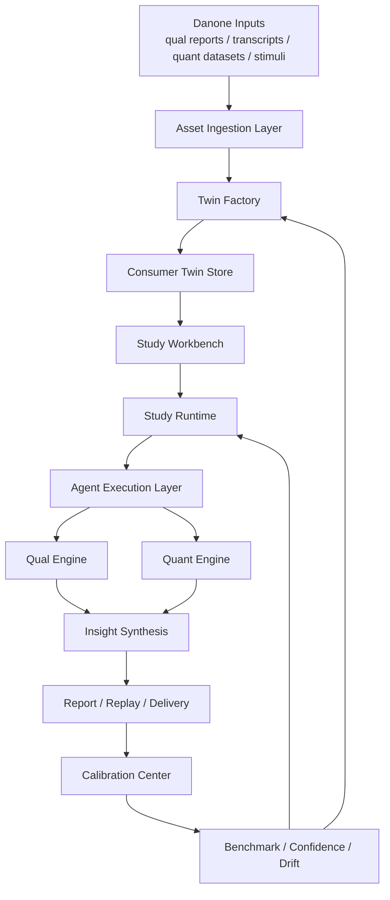
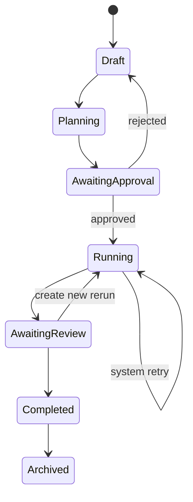
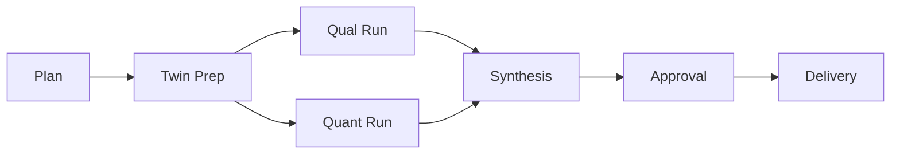
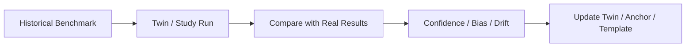

# 达能 AI Consumer Runtime 系统设计

文档版本：v1  
日期：2026-04-02  
状态：详细设计草案  
适用范围：达能单租户单行业交付版  
部署策略：`vendor-hosted 优先，预留未来迁移接口`

## 1. 文档目标

本文档用于定义达能 `AI Consumer Runtime` 的完整系统设计，覆盖：

- 业务目标与范围
- 系统边界与非目标
- 总体架构
- 前后端模块划分
- 数据模型与存储设计
- Study Runtime 状态机
- Agent 编排与 Qual / Quant 双引擎
- 评测校准体系
- 权限、安全、审计与迁移预留
- MVP 边界与落地建议

本文档的目标不是解释“AI 能做什么”，而是明确：

- 这个系统如何作为一个 `可运行、可恢复、可审批、可评测、可治理` 的研究运行时成立
- 它如何满足达能比稿要求中的 `consumer twins + 定性学习 + 定量测试 + SaaS 平台 + 未来可迁移`

## 2. 项目背景与业务目标

### 2.1 来自达能 brief 的明确要求

达能本次项目的目标不是做一个单点 AI persona 展示，而是建设一个可支持营销决策的 AI 消费者学习与测试系统，核心要求包括：

- 更好理解目标消费者
- 更敏捷地筛选和验证大量营销刺激物
- 同时提供定性与定量视角
- 支持以下刺激物测试：
  - innovation concept
  - product names / flavors
  - communication assets
  - KV / copy / slogan / tagline
- 形成 `Danone owned consumer twins`
- 以 SaaS 平台方式交付
- 未来保留 Danone 本地化 / on-prem 迁移可能

### 2.2 本次设计的适用业务场景

本设计聚焦达能中国场景，覆盖：

- 品类：
  - Beverage
  - Infant Milk Formula
- 目标人群：
  - 饮料用户
  - 孕妇
  - 0-3 岁孩子的妈妈
- 决策类型：
  - 新品 / 包装 / 概念测试
  - 人群理解与内容策略启发

### 2.3 首版系统的核心业务目标

系统需要帮助达能市场与洞察团队在 `小时级` 时间内完成以下任务：

- 对多个刺激物进行快速优先级筛选
- 理解目标人群为何喜欢 / 不喜欢某类刺激物
- 把历史研究资产转化为可复用的 consumer twins
- 将研究过程、证据链和结论显式化
- 建立初步可信度和校准闭环

## 3. 设计原则

### 3.1 Runtime-first

系统的最小产品单元不是 prompt，不是 agent，不是单次聊天，而是 `Study Runtime`。

任何 AI 执行行为都必须挂靠在显式业务对象上：

- Study
- StudyPlan
- StudyRun
- RunStep
- ConsumerTwin
- Artifact
- CalibrationRun

### 3.2 Danone-owned Asset First

系统必须把 consumer twins、历史研究包、锚点库、模板库和 benchmark 结果沉淀为达能可复用资产，而不是供应商黑箱服务。

### 3.3 Qual / Quant 双引擎并列

定性与定量在首版就是并列的一等能力，不能先做成单边系统。

### 3.4 可解释优先于纯自动化

达能会采购的是 `可靠决策支持`，不是“最自动的 AI”。因此必须优先保证：

- 计划可看
- 过程可看
- 证据可看
- 评分可回溯
- 偏差可解释

### 3.5 Vendor-hosted 优先，迁移预留

首版不为 on-prem 过度设计，但必须保证：

- 核心对象可导出
- 基础设施可替换
- 资产可重建

## 4. 系统边界

### 4.1 系统是什么

系统本质上是一个 `Danone AI Consumer Learning Runtime`，上层表现为一个面向市场与洞察团队的研究工作台。

它负责：

- 管理研究资产
- 构建 consumer twins
- 创建研究并执行 qual / quant 测试
- 产出报告、评分、回放
- 通过 benchmark 和真实结果做校准

### 4.2 系统不是什么

首版系统不负责：

- 替代 CDP / CRM
- 直接执行媒体投放
- 替代企业 BI 中台
- 变成泛化营销操作系统
- 覆盖所有经营决策场景

## 5. 高层架构

## 6. 参考 Atypica 的设计吸收

本设计不照抄 Atypica 的产品定位，但明确吸收其高价值模式：

- `Plan Mode`
  - 先生成研究计划，再执行
- `Execution Timeline`
  - 研究运行过程可视化
- `Replay`
  - 研究可回放、可分享、可追责
- `阶段化执行`
  - 研究不是单轮问答，而是多阶段运行
- `Memory / Assetization`
  - 输出不是聊天记录，而是可复用研究资产

达能版与 Atypica 的差异在于：

- 更强调 `Danone-owned twins`
- 更强调 `Calibration Center`
- 更强调 `Qual / Quant` 双引擎
- 更强调未来 `vendor-hosted -> localization` 的资产迁移

## 7. 核心对象模型

### 7.1 Workspace Domain

#### `workspace`

达能项目级单租户空间。

核心字段：

- `id`
- `name`
- `tenant_code`
- `deployment_mode`
- `status`
- `created_at`

#### `user`

核心字段：

- `id`
- `workspace_id`
- `email`
- `display_name`
- `role`
- `status`

#### `team`

可按市场、洞察、管理员等逻辑分组。

#### `policy`

存储：

- 导出策略
- 审批策略
- 模型调用策略
- 数据访问策略

#### `data_connection`

描述外部输入连接：

- S3
- 文件批量导入
- 未来 CDP / CRM 接口

### 7.2 Research Asset Domain

这一层必须区分 `导入注册对象` 和 `类型化业务对象`，不能把所有东西都压进一个 `asset_type` 大表。

#### `asset_manifest`

这是导入注册层，只负责记录“进来了一份什么文件/包”，不承载业务语义。

关键字段：

- `id`
- `workspace_id`
- `source_type`
- `mime_type`
- `original_filename`
- `storage_uri`
- `ingestion_status`
- `ingestion_profile`
- `ingestion_options_json`
- `created_at`

`ingestion_profile` 是一个枚举字符串，用于决定“这份输入走哪条标准解析路径”。

`ingestion_profile` 值域建议：

- `qual_report_doc`
- `qual_transcript_doc`
- `quant_dataset_structured`
- `stimulus_image_pack`
- `stimulus_text_pack`
- `benchmark_bundle`

`ingestion_options_json` 用于承载 profile 下的可选参数，例如：

- 语言
- 页码范围
- 是否 OCR
- 分隔符策略
- 问卷编码映射策略

#### `ingestion_job`

表示一次解析任务实例，是 `/ingestion/jobs` 的持久化对象。

关键字段：

- `manifest_id`
- `ingestion_profile`
- `parser_type`
- `parser_options_json`
- `target_object_type`
- `status`
- `error_summary`
- `triggered_by`
- `started_at`
- `ended_at`

#### `qual_report`

表示一份定性研究报告。

关键字段：

- `manifest_id`
- `brand`
- `category`
- `study_period`
- `report_type`
- `summary_json`

#### `transcript_corpus`

表示一组经过结构化处理的访谈文本。

关键字段：

- `manifest_id`
- `source_report_id`
- `speaker_schema`
- `chunking_strategy`
- `language`
- `vectorization_status`

#### `quant_dataset`

表示一份定量研究数据集。

关键字段：

- `manifest_id`
- `source_report_id`
- `file_format`
- `schema_mapping_id`
- `respondent_count`
- `questionnaire_version`
- `normalization_status`

#### `dataset_schema_mapping`

用于解决 quant 数据集解析的最难问题，即字段映射与指标解释。

关键字段：

- `dataset_id`
- `field_mapping_json`
- `metric_mapping_json`
- `manual_review_status`
- `reviewed_by`

#### `stimulus`

这是待测试刺激物的业务对象，不属于“历史研究资产”。

类型包括：

- concept
- packaging
- name
- flavor
- kv
- copy
- slogan
- tagline

关键字段：

- `stimulus_type`
- `title`
- `brand`
- `category`
- `version`
- `source_manifest_id`
- `content_ref`
- `status`

说明：

- `source_manifest_id` 仅表示来源文件包，可为空
- `stimulus` 绝不通过 `research_asset` 语义来定义自己

#### `anchor_set`

这是 SSR 的一级核心对象，不能隐含存在。

关键字段：

- `id`
- `name`
- `category_scope`
- `study_type_scope`
- `scale_type`
- `version_no`
- `generation_method`
- `status`

`generation_method` 值域定义：

- `expert_authored`
- `historical_scale_adapted`
- `llm_draft_human_approved`
- `historical_quant_distilled`

#### `anchor_statement`

表示某个 anchor set 内的具体锚点语句。

关键字段：

- `anchor_set_id`
- `likert_value`
- `statement_text`
- `embedding_ref`
- `language`

#### `benchmark_pack`

表示一组可用于校准的历史标准包。

关键字段：

- `id`
- `name`
- `brand`
- `category`
- `study_type`
- `granularity`
- `metric_scope`
- `source_dataset_ids`
- `source_asset_refs_json`
- `build_review_status`
- `status`

建立流程：

1. 从 `quant_dataset` 或结构化历史研究结果中抽取可对照指标
2. 通过 `dataset_schema_mapping` 做字段与指标映射
3. 进入人工 review，确认 metric_scope 与 granularity
4. 生成 `benchmark` 明细
5. 发布为 `benchmark_pack`

说明：

- `benchmark_pack` 只能由人工 review 后发布，不能直接由 parser 自动发布
- 同一 `benchmark_pack` 可同时引用多个 `quant_dataset`、`qual_report` 或人工整理结论
- 发布后默认只追加新版本，不覆盖旧 pack，保证 calibration 可追溯

#### `prompt_template`

显式管理模板版本。

关键字段：

- `template_type`
- `scope`
- `version_no`
- `body`
- `status`

#### `agent_config`

显式管理 agent 执行配置版本。

关键字段：

- `agent_type`
- `model_provider`
- `model_name`
- `temperature`
- `tool_policy_json`
- `template_version_refs`
- `version_no`
- `status`

### 7.3 Audience / Twin Domain

#### `target_audience`

定义研究目标人群。

示例：

- Beverage users
- Pregnant women
- Moms with kids aged 0-3

关键字段：

- `name`
- `category`
- `definition_json`
- `business_tags`

#### `persona_profile`

叙事型画像，是一个可复用的“画像原型”，不是执行时快照。

关键字段：

- `target_audience_id`
- `profile_name`
- `segmentation_tags`
- `fact_layer_json`
- `narrative_text`
- `source_lineage`
- `confidence_score`

#### `consumer_twin`

这是达能拥有的业务级 twin 标识，代表一个被长期维护的消费者孪生体。

关键字段：

- `target_audience_id`
- `persona_profile_id`
- `business_purpose`
- `status`
- `applicable_scenarios`
- `owner = Danone`

关系定义：

- 一个 `target_audience` 可以对应多个 `persona_profile`
- 一个 `persona_profile` 可以被多个 `consumer_twin` 复用
- `consumer_twin` 是逻辑身份，真正执行时使用 `twin_version`

#### `twin_version`

这是执行时不可变快照，解决 profile 变动导致的可追溯性问题。

关键字段：

- `consumer_twin_id`
- `version_no`
- `persona_profile_snapshot_json`
- `anchor_set_id`
- `agent_config_id`
- `source_lineage`
- `benchmark_status`
- `created_at`

规则：

- twin 校准后生成新 version，不回写修改旧 version
- study_run 永远引用具体 `twin_version_id`

### 7.4 Study Runtime Domain

#### `study`

研究主对象。

关键字段：

- `business_question`
- `study_type`
- `brand`
- `category`
- `target_groups`
- `status`
- `owner_team_id`

#### `study_plan`

这是 study 下的“当前计划头对象”，用于指向最新版本并承载编辑态信息。

关键字段：

- `study_id`
- `current_draft_version_no`
- `latest_approved_version_no`
- `current_execution_version_no`
- `draft_status`
- `last_generated_by`
- `updated_at`

说明：

- `study_plan` 只是可变头对象，不直接作为审批和执行输入
- 前端审批页、Planner Agent schema 校验、Study Runtime 执行，统一以 `study_plan_version` 为准
- `study_plan` 的作用是让业务层总能拿到“当前草稿 / 当前已批准 / 当前执行中”的版本指针

#### `study_plan_version`

Planner Agent 的输出必须落到不可变版本对象，供审批与运行引用。

关键字段：

- `id`
- `study_id`
- `version_no`
- `business_goal_json`
- `twin_version_ids`
- `stimulus_ids`
- `anchor_set_id`
- `agent_config_ids`
- `qual_config_json`
- `quant_config_json`
- `estimated_cost`
- `approval_required`
- `approval_status`
- `approved_at`
- `generated_by`
- `status`

说明：

- `study_plan_version` 是审批页展示、运行时绑定、回放和 calibration 追溯的唯一计划对象
- 一次 `study_run` 必须绑定且只绑定一个 `study_plan_version_id`
- 如果计划变更影响 `twin_version_ids`、`stimulus_ids`、`anchor_set_id` 或 `agent_config_ids`，则必须生成新版本，不能原地修改

#### `study_run`

一次具体执行实例。

关键字段：

- `study_id`
- `study_plan_version_id`
- `run_type`
- `status`
- `workflow_id`
- `workflow_run_id`
- `rerun_of_run_id`
- `reuse_source_run_id`
- `rerun_from_stage`
- `started_at`
- `ended_at`

#### `run_step`

显式的步骤级记录。

示例步骤：

- plan_generation
- twin_preparation
- qual_execution
- quant_execution
- scoring
- synthesis
- report_generation
- delivery

关键字段：

- `study_run_id`
- `step_type`
- `status`
- `activity_ref`
- `output_ref`
- `error_code`
- `attempt_no`
- `approval_scope`

#### `qual_session`

表示一次 qual 执行会话。

关键字段：

- `study_run_id`
- `session_type`
- `target_scope`
- `agent_config_id`
- `status`
- `started_at`
- `ended_at`

#### `qual_transcript`

表示由 Qual Agent 生成的输出型访谈记录，与输入历史 `transcript_corpus` 严格区分。

关键字段：

- `qual_session_id`
- `twin_version_id`
- `stimulus_id`
- `transcript_ref`
- `turn_count`
- `speaker_map_json`
- `summary_json`

#### `qual_theme_set`

表示从 qual transcript 中抽取出的结构化主题集合。

关键字段：

- `qual_session_id`
- `theme_schema_version`
- `theme_json`
- `evidence_ref_json`
- `source_agent_config_id`
- `confidence_score`

#### `qual_theme_item`

表示可被 Synthesis 直接消费的最小主题单元。

关键字段：

- `qual_theme_set_id`
- `theme_key`
- `theme_label`
- `polarity`
- `salience_score`
- `stimulus_scope`
- `audience_scope`
- `evidence_ref_json`

#### `approval_gate`

审批节点对象。

字段：

- `scope_type`
- `scope_ref_id`
- `approval_type`
- `status`
- `requested_by`
- `approved_by`
- `decision_comment`

#### `artifact`

研究产物对象。

关键字段：

- `study_run_id`
- `artifact_type`
- `format`
- `storage_uri`
- `artifact_manifest_json`
- `generated_by`
- `status`

类型：

- report
- replay
- presentation_export
- summary
- confidence_snapshot

#### `twin_response`

这是 SSR 两步法中的中间产物对象，保存 twin 对 stimulus 的开放式反馈。

关键字段：

- `study_run_id`
- `twin_version_id`
- `stimulus_id`
- `replica_no`
- `response_mode`
- `response_text`
- `response_json`
- `source_agent_config_id`

#### `scoring_result`

这是对 `twin_response` 做 SSR 映射后的结构化评分结果。

关键字段：

- `study_run_id`
- `twin_response_id`
- `anchor_set_id`
- `scoring_method`
- `score_distribution_json`
- `top_box_score`
- `rank_score`
- `segment_key`

#### `segment_comparison_result`

表示多 twin / 多人群对比结果。

关键字段：

- `study_run_id`
- `stimulus_id`
- `comparison_scope`
- `difference_metrics_json`
- `significance_method`
- `confidence_score`

### 7.5 Evaluation Domain

#### `benchmark`

历史研究导入后形成的标准对照单元。

关键字段：

- `benchmark_pack_id`
- `study_type`
- `category`
- `granularity`
- `stimulus_id`
- `metric_scope`
- `ground_truth_json`
- `source_reference_json`

#### `calibration_run`

这是独立运行时对象，不属于 study 状态机。

关键字段：

- `benchmark_pack_id`
- `scope_type`
- `scope_ref_id`
- `status`
- `started_at`
- `ended_at`
- `metrics_json`
- `recommendation_json`

说明：

- `scope_type` 可取 `twin_version` / `anchor_set` / `agent_config` / `template`

#### `confidence_snapshot`

记录某时点、某 scope 上的可信度。

关键字段：

- `scope_type`
- `scope_ref_id`
- `study_type`
- `category`
- `confidence_score`
- `metric_breakdown_json`
- `freshness_factor`
- `snapshot_at`

#### `drift_alert`

标记：

- 人群理解漂移
- 评分漂移
- 结论偏差升高

关键字段：

- `scope_type`
- `scope_ref_id`
- `drift_type`
- `severity`
- `evidence_json`
- `status`

## 8. 存储设计

### 8.1 PostgreSQL

Postgres 用于保存：

- 业务主对象
- 状态机状态
- 审批与审计索引
- twin / study / benchmark 元数据

### 8.2 Object Storage

对象存储用于：

- 历史研究报告原件
- transcript 原文
- quant 数据表
- 刺激物文件
- report / replay 导出物
- qual 原始 transcript 输出
- quant 原始 response dump
- 中间快照

归属规则：

- 原始大文本与文件进 object storage
- 结构化摘要与 themes 进 Postgres
- workflow history 只存引用，不存大文本正文

### 8.3 Vector / Retrieval Layer

用于：

- persona 片段检索
- transcript 片段检索
- anchor set 检索
- 研究知识与案例检索

MVP 阶段可采用：

- `pgvector`

检索设计要求：

- `transcript` 默认按主题段落和说话轮次双重切块，不按整篇检索
- `persona` 默认按 facet + narrative summary 双粒度切块
- `anchor_statement` 逐条向量化
- 检索默认先做 `category / study_type / language` 过滤，再做向量召回

### 8.4 Workflow State Store

用于：

- workflow history
- signals / approvals
- retry and recovery state

推荐使用：

- `Temporal`

说明：

- `Temporal` 是 workflow state 的真源
- Postgres 只保存 workflow id、run id、派生状态与业务索引
- 不在业务库额外维护 checkpoint refs，避免状态双写分裂

## 9. 前端信息架构

### 9.1 一级导航

- `Dashboard`
- `Studies`
- `Consumer Twins`
- `Stimulus Library`
- `Reports & Replay`
- `Calibration Center`
- `Admin / Settings`

### 9.2 核心页面

#### Dashboard

展示：

- 在跑研究
- 待审批任务
- 最近输出
- confidence 状态
- calibration 状态

#### Study List

支持：

- 按品牌、品类、目标人群、研究类型过滤
- 快速查看状态、最近结果、信心分数

#### Study Detail

最核心页面，包含：

- Plan
- Execution Timeline
- Qual Insights
- Quant Results
- Replay
- Approval History
- Artifacts

其中 `Replay` 页签显示的不是聊天记录，而是由结构化运行时数据生成的研究执行视图。

#### Consumer Twins Center

展示：

- target audience
- twin 画像
- twin 来源
- twin 版本
- twin 适用场景
- 最近被哪些 study 使用

#### Stimulus Library

统一管理：

- 概念
- 包装
- 命名
- 口味
- KV
- copy
- slogan / tagline

#### Calibration Center

展示：

- benchmark packs
- calibration runs
- confidence curves
- drift alerts
- human override records

## 10. 后端服务拆解

### 10.1 Workbench API

角色：

- 前端唯一聚合入口
- 负责 query / command 聚合

提供：

- workspace queries
- study commands
- twin queries
- report/replay queries

### 10.2 Asset Ingestion Service

职责：

- 导入 qual / quant 资产
- 根据 `ingestion_profile` 分发到不同解析路径
- 生成 asset manifest 与类型化业务对象

子路径包括：

- `qual_report_parser`
- `transcript_parser`
- `quant_dataset_parser`
- `stimulus_parser`

说明：

- 不采用一个巨大 parse if-else 处理所有资产
- quant dataset 解析必须走 schema mapping + 人工确认环节

### 10.3 Twin Factory Service

职责：

- 从历史研究与 target audience 生成 persona_profile
- 生成 consumer_twin
- 维护 twin_version

### 10.4 Study Runtime Service

职责：

- 创建 study
- 持有 `StudyWorkflow`
- 驱动状态机
- 下发审批 signal
- 管理 resume / rerun / retry 策略
- 记录 run / step 派生状态

在实现上：

- `Study Runtime Service` 是 Temporal Workflow 的宿主层
- 它不直接执行业务智能逻辑，只编排阶段与副作用

### 10.5 Agent Execution Service

职责：

- 作为 Workflow Activities / Adapters 执行具体 agent 任务
- 调用 Planner / Qual / Quant / Scoring / Report agents
- 管理 agent configuration version
- 回写结构化 outputs

边界说明：

- 它不是与 Runtime 平级的“第二个编排器”
- 它是 Runtime 内部被调度的执行层
- 如果未来迁移模型或 agent framework，这一层是主要替换点

### 10.6 Calibration Service

职责：

- 导入真实研究结果
- 对照 benchmark
- 计算 confidence / drift / bias
- 反馈到 twin / anchor / template

边界说明：

- `Calibration Service` 负责确定性的数值与规则计算
- 如需 LLM 解释偏差来源，可由 `Calibration Analysis Agent` 提供补充说明
- 二者不是重复关系，而是“统计计算”与“解释生成”的分工

## 11. API 边界

### 11.1 Assets API

#### `POST /assets/import`

导入研究报告、dataset、stimulus。

#### `GET /assets`

查询资产。

#### `POST /ingestion/jobs`

触发解析与抽取。

请求必须带：

- `manifest_id`
- `ingestion_profile`
- `parser_type`

可选参数：

- `parser_options_json`

说明：

- `ingestion_profile` 是业务级输入分类枚举
- `parser_type` 是技术级解析器实现，例如 `qual_report_parser`、`quant_dataset_parser`
- profile 决定目标流程，parser 决定具体执行器

返回：

- ingestion_job_id
- target_object_type

### 11.2 Twins API

#### `GET /audiences`

查询目标人群。

#### `POST /twins/generate`

生成或更新 consumer twin。

#### `GET /twins/{id}`

查询 twin 详情与版本信息。

### 11.3 Studies API

#### `POST /studies`

创建研究。

#### `POST /studies/{id}/plan`

生成或更新研究计划。

#### `POST /studies/{id}/approve`

审批计划或阶段。

#### `POST /studies/{id}/runs`

启动运行。

#### `POST /runs/{id}/resume`

恢复运行。

#### `POST /runs/{id}/rerun`

基于 review 或参数调整创建新 run。

#### `GET /studies/{id}/replay`

查看回放。

### 11.4 Evaluation API

#### `POST /benchmarks/import`

导入历史 benchmark。

#### `POST /benchmark-packs/build`

基于 `quant_dataset` 与 `dataset_schema_mapping` 构建 benchmark pack。

#### `POST /calibration/runs`

发起校准。

#### `GET /confidence`

查看某个 scope 的可信度状态。

## 12. 运行时设计

### 12.1 Study 状态机

说明：

- `Study` 状态机只表达业务级生命周期
- mid-run 审批不会把 `Study` 拉出 `Running`
- mid-run 挂起由 `study_run.status = awaiting_midrun_approval` 表达，这是显式设计决定，不单独增加 `Study` 状态

### 12.2 状态定义

- `Draft`
  - 新建研究，尚未形成计划
- `Planning`
  - Planner Agent 生成计划
- `AwaitingApproval`
  - 计划待人工批准
- `Running`
  - 正在执行 qual / quant / synthesis
- `AwaitingReview`
  - 等待人工审阅结果
- `Completed`
  - 研究已完成
- `Archived`
  - 归档

### 12.3 挂起点

以下场景必须挂起：

- 计划审批
- 大规模运行前审批
- 高风险导出审批
- 结果发布审批
- 评分异常人工复核

### 12.4 恢复机制

恢复原则：

- 以 `study_run` 为单位恢复
- 从 Temporal workflow history 恢复
- 已完成步骤不重跑
- 工具结果以幂等键保障不重复回写

### 12.5 Run 级状态

`Study` 表示业务级生命周期，`StudyRun` 表示执行级生命周期。

建议 `study_run.status` 值域：

- `created`
- `running`
- `awaiting_midrun_approval`
- `failed`
- `completed`
- `cancelled`

说明：

- mid-run 审批不改变 `study.status`
- 当 workflow 在执行中遇到审批点时，`study_run.status = awaiting_midrun_approval`
- 审批通过后回到 `running`

### 12.6 revise and rerun 语义

`AwaitingReview -> Running` 的语义不是回滚旧 run，而是：

- 保留原 `study_run` 不变
- 创建新的 `study_run`
- 显式记录：
  - `rerun_of_run_id`
  - `reuse_source_run_id`
  - `rerun_from_stage`
  - `rerun_reason`

规则：

- 新 run 默认继承上一个已批准的 `study_plan_version_id`
- 只有当用户先生成并批准了新的 `study_plan_version`，rerun 才允许切换计划版本
- Runtime 通过 `reuse_source_run_id` 加载上一次 run 的 `run_step.output_ref` 与结构化对象，而不是“假装步骤已经执行过”
- 如果新计划版本改变了 `twin_version_ids`、`stimulus_ids`、`anchor_set_id` 或 `agent_config_ids`，则 `rerun_from_stage` 不得晚于 `twin_preparation`

默认 `rerun_from_stage` 可取：

- `twin_preparation`
- `qual_execution`
- `quant_execution`
- `synthesis`

skip-and-reuse 规则：

- 若 `rerun_from_stage = twin_preparation`
  - 重新生成 twin execution snapshot
- 若 `rerun_from_stage = qual_execution`
  - `reuse_source_run_id = rerun_of_run_id`
  - 复用上一个 run 的 `twin_version_ids`
  - 复用同一 `study_plan_version_id`
  - 丢弃旧 qual / quant / synthesis 输出，重新生成
- 若 `rerun_from_stage = quant_execution`
  - `reuse_source_run_id = rerun_of_run_id`
  - 复用 `twin_version_ids`
  - 复用 `qual_session / qual_theme_set`
  - 要求 `stimulus_ids` 与 `anchor_set_id` 不变
  - 仅重跑 quant / synthesis
- 若 `rerun_from_stage = synthesis`
  - `reuse_source_run_id = rerun_of_run_id`
  - 复用 qual / quant 全部结构化输出
  - 仅重跑 synthesis / report

## 13. Agent 编排设计

### 13.1 编排原则

`Workflow outside, agents inside`

即：

- Workflow Runtime 负责阶段、状态、审批、恢复
- Agent Execution 负责阶段内部的智能任务

### 13.2 编排阶段

默认策略：

- `Qual` 与 `Quant` 并行
- 只有当研究计划显式要求“Qual 先行探索再 Quant 定型”时才串行

### 13.3 Agent 角色

#### Planner Agent

输出：

- `study_plan_version`

#### Twin Builder Agent

输出：

- PersonaProfile
- ConsumerTwin

#### Qual Agent

输出：

- `qual_session`
- `qual_transcript`
- `qual_theme_set`
- `qual_theme_item`

#### Quant Agent

输出：

- twin_response
- option ranking candidates
- segment differences candidates

#### SSR / Scoring Agent

输出：

- scoring_result
- candidate ranking
- segment_comparison_result

#### Insight Synthesis Agent

输入：

- `qual_theme_item`
- `qual_theme_set`
- `qual_transcript.summary_json`
- `scoring_result`
- `segment_comparison_result`
- `study_plan_version`

输入约束：

- 只消费类型化结构化对象，不直接消费原始 workflow history
- 如需回看全文对话，只通过 `qual_transcript.transcript_ref` 做按需检索，不把原始 transcript 直接塞入常规 synthesis 上下文

输出：

- recommendations
- evidence chains

#### Report Agent

输出：

- report
- replay
- summary

#### Calibration Agent

输出：

- 偏差来源解释
- 校准建议文本

说明：

- `calibration_run`、`confidence_snapshot`、`drift_alert` 由 Calibration Service 产出
- Calibration Agent 只负责生成解释性补充

## 14. Qual / Quant 双引擎设计

### 14.1 Qual Engine

用于回答：

- 为什么喜欢 / 不喜欢
- 哪些情绪或联想被触发
- 创新概念是否有启发性
- 文案、命名、口味的潜在理解偏差

执行形式：

- AI IDI
- AI mini FGD
- multi-twin comparative discussion

标准输出链：

- `qual_session`
- `qual_transcript`
- `qual_theme_set`
- `qual_theme_item`

说明：

- Qual 输出绝不回写到输入侧的 `transcript_corpus`
- 历史访谈是 twin 构建输入，`qual_transcript` 是研究执行输出，二者必须严格分层

### 14.2 Quant Engine

用于回答：

- 哪个刺激物更强
- 强多少
- 哪类人群差异最大
- 哪些候选更适合进入下一轮真实测试

执行形式：

- option-based ranking
- structured reaction scoring
- SSR-based score mapping

SSR 标准路径：

1. twin 对每个 stimulus 生成开放式文本反馈，落到 `twin_response`
2. 从 `anchor_set` 取对应锚点语句
3. 用 embedding cosine similarity 做相似度映射
4. 输出 `scoring_result`
5. 基于多 twin / 多分组聚合得到 `segment_comparison_result`

### 14.3 Quant 采样与并发策略

每次 quant run 必须显式配置：

- `audience_groups`
- `twin_versions_per_group`
- `replicas_per_twin`
- `parallelism_limit`
- `significance_method`

默认建议：

- 每个 target audience 选 3-5 个 twin versions
- 每个 twin version 跑 3-5 次 replica
- 按 audience group 并发

人群差异不是统计学最终证明，而是“模拟差异信号”，必须带 confidence 标记。

### 14.4 输出整合

一次完整研究的标准输出必须同时包含：

- 定性洞察
- 定量结论
- 证据链
- 人群差异
- confidence score

## 14.5 Replay Artifact 设计

`Replay` 不是原始 workflow history 的直接暴露，而是一个面向业务可读性的结构化执行视图。

实现定义：

- 数据来源：
  - `study_run`
  - `run_step`
  - `approval_gate`
  - `qual_transcript.summary_json`
  - `scoring_result`
  - `segment_comparison_result`
- 物理形态：
  - 一个结构化 `replay_json`
  - 一个可渲染 HTML 视图
- 生成方式：
  - 运行过程中逐步累积 step-level replay data
  - 研究完成后由 Report Agent 生成最终业务视图
- artifact 落盘方式：
  - `artifact_type = replay`
  - `format = replay_json` 或 `html`
  - `artifact_manifest_json` 保存 schema 版本、引用的 step 列表和渲染参数

这样做的原因：

- 保留技术可追踪性
- 不把底层 workflow event history 直接暴露给业务用户
- 便于未来导出和分享

## 15. 评测与校准设计

### 15.1 Benchmark Pack

将历史研究导入后打包成 benchmark packs，用于：

- 同类 study 的历史对照
- twin 校准
- scoring template 校准

benchmark 的最小粒度设计：

- 可支持 `study-level`
- 可支持 `stimulus-level`
- 必须记录 `metric_scope`

### 15.2 指标体系

#### Accuracy Metrics

- ranking hit rate
- segment difference accuracy
- top concern hit rate
- score alignment

#### Trust Metrics

- confidence score
- calibration freshness
- human override rate

`confidence_score` 的最小计算口径建议由四部分组成：

- ranking accuracy contribution
- score alignment contribution
- calibration freshness decay
- human override penalty

建议公式：

`confidence_score = w1 * ranking_accuracy + w2 * score_alignment + w3 * freshness_factor - w4 * human_override_rate`

其中：

- `freshness_factor = exp(-lambda * days_since_last_calibration)`
- `lambda` 按 `study_type` 可配置

计算时机：

- 每次 `calibration_run` 完成后立即计算并写入 `confidence_snapshot`
- 每日批处理任务根据 freshness 规则衰减历史 confidence

作用粒度建议：

- 默认粒度：`scope_type + study_type + category`
- 例如：
  - `twin_version + concept_test + beverage`
  - `anchor_set + naming_test + imf`

责任分工：

- `Calibration Service` 负责计算并写入 `confidence_snapshot`
- 定时维护任务只负责 freshness 衰减，不改写历史 calibration 原始指标

#### Ops Metrics

- run success rate
- recovery success rate
- cost per study
- approval SLA

### 15.3 校准闭环

说明：

- Calibration 是独立运行，不改变 study 状态机
- 一次 calibration run 可作用于多个历史 study 的结果集

### 15.4 漂移管理

必须检测：

- twin drift
- scoring drift
- scenario drift
- prompt drift

## 16. 权限、安全与审计

### 16.1 单租户隔离

实现方式：

- 独立 workspace
- 独立存储前缀
- 独立数据库逻辑域
- 独立密钥与策略

### 16.2 RBAC

建议角色：

- `marketing_user`
- `insight_user`
- `admin`

### 16.3 审批策略

必须审批的操作：

- study plan approval
- large run approval
- report publishing approval
- high-risk export approval

### 16.4 PII 与内容安全

要求：

- transcript 脱敏处理
- 原始文本分级访问
- prompt log 脱敏
- 模型调用策略受控

### 16.5 审计留痕

必须记录：

- 谁导入了资产
- 谁生成了 plan
- 谁批准了 run
- 使用了哪些 twin / anchor / templates
- 谁导出了报告

## 17. 迁移预留设计

### 17.1 当前策略

当前按 `vendor-hosted` 设计，不引入额外 on-prem 复杂度。

### 17.2 必须预留的迁移能力

#### 数据可迁移

- Postgres 主对象可导出
- Object storage 文件可导出
- Vector 输入源可重建
- Workflow state 可快照导出

#### 基础设施可替换

- 模型网关抽象
- Agent Runner 抽象
- 存储适配器抽象
- 检索层抽象
- Workflow backend 可重新挂接

#### 资产可重建

- consumer twins
- benchmark packs
- anchor sets
- templates
- artifacts

## 18. 推荐技术栈

### 18.1 后端

- `Python`
- `FastAPI`

### 18.2 Workflow Runtime

- `Temporal`

### 18.3 Agent Execution

- `OpenAI Agents SDK`（MVP 执行适配器）

补充要求：

- 业务层不得直接依赖 OpenAI SDK 类型
- 必须通过内部 `AgentRunner` 接口访问 agent execution
- 未来如迁移到非 OpenAI 模型或私有化 agent stack，只替换适配器层

### 18.4 主数据库

- `PostgreSQL`

### 18.5 检索

- `pgvector`

### 18.6 对象存储

- `S3-compatible object storage`

### 18.7 可观测性

- `OpenTelemetry`
- agent tracing
- workflow visibility

### 18.8 技术风险与缓解

#### 风险：OpenAI Agents SDK 与未来本地化存在锁定

缓解：

- 仅在 adapter 层使用 SDK
- 通过 `ModelGateway + AgentRunner` 做供应商隔离
- twin、study、scoring、calibration 对象与 OpenAI SDK 解耦

#### 风险：Temporal 引入学习与运维成本

缓解：

- MVP 阶段只实现两类 workflow：
  - `StudyWorkflow`
  - `CalibrationWorkflow`
- 本地开发使用 docker compose + 单 worker 模式
- Activity 保持无状态、纯函数化优先
- 不在 MVP 阶段引入复杂 child workflow / saga 编排

## 19. MVP 范围

### 19.1 必须交付

- 单租户 Danone workspace
- 历史 qual / quant 资产导入
- target audience + twin 生成
- study 创建、计划、审批、运行
- qual / quant 双引擎执行
- report + replay
- calibration center

### 19.2 不做

- 多租户 SaaS 完整化
- 全经营场景覆盖
- 投放执行闭环
- 通用品牌自助平台市场化

## 20. 最大风险与缓解

### 风险 1：历史研究资产质量不一

缓解：

- ingestion 标准化
- benchmark 分层
- confidence 按来源加权

### 风险 2：Twin 可信度不足

缓解：

- twin versioning
- calibration required
- high-risk conclusion 人工复核

### 风险 3：Qual / Quant 结果不一致

缓解：

- synthesis 中显式展示冲突
- 不能强行合并
- 对冲突给出低 confidence 标记

### 风险 4：系统被误解成“自动替代消费者研究”

缓解：

- 明确定位为研究增强与前置筛选运行时
- 通过 calibration center 管理信任边界

## 21. 结论

达能首版系统的正确形态不是“AI persona 工具”，也不是“聊天式报告平台”，而是：

一个面向母婴、食品、饮料场景的 `Danone AI Consumer Runtime`。

其核心成立条件有五个：

- `Danone-owned twins`
- `Qual / Quant 双引擎`
- `Study Runtime 状态机`
- `Calibration Center`
- `Vendor-hosted 优先但可迁移`

只要这五个成立，系统就能既满足本次比稿，又为后续平台化和本地化保留空间。
